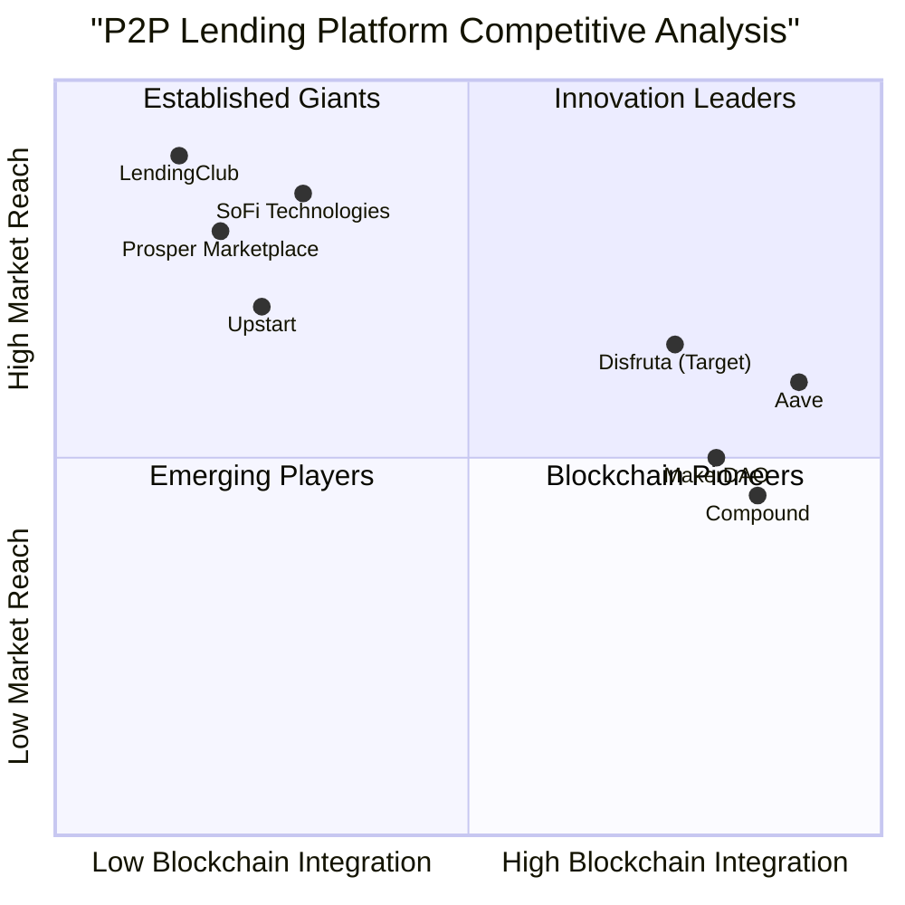

# Product Requirements Document (PRD)
# Disfruta - Blockchain-Powered Peer-to-Peer Lending Platform

**Version:** 1.0  
**Date:** June 13, 2025  
**Language:** English  
**Programming Languages:** React, JavaScript, Solidity, Tailwind CSS  
**Project Name:** disfruta_p2p_lending_platform  

## Original Requirements Restatement
Build a fully functional peer-to-peer lending platform called Disfruta using blockchain technology, mirroring Prosper Marketplace functionality, including landing page, user authentication, credit check logic, borrowers/lenders pages, smart contract integration, and comprehensive business logic.


## 1. Product Definition

### 1.1 Product Goals

**Goal 1: Democratize Access to Credit**  
Create a blockchain-powered platform that provides underserved borrowers with accessible, transparent, and fair lending opportunities while eliminating traditional banking intermediaries.

**Goal 2: Generate Attractive Returns for Investors**  
Offer individual and institutional lenders competitive investment opportunities with automated risk assessment, diversified portfolios, and transparent performance tracking.

**Goal 3: Establish Secure and Transparent Financial Infrastructure**  
Leverage blockchain technology and smart contracts to ensure immutable transaction records, automated loan processing, and enhanced security measures that build trust among all platform participants.

### 1.2 User Stories

**As a borrower seeking personal financing:**
- I want to apply for loans with minimal paperwork and fast approval times so that I can access funds quickly for debt consolidation, home improvements, or emergency expenses.
- I want transparent loan terms and competitive interest rates so that I can make informed financial decisions without hidden fees.
- I want automated repayment options and clear payment schedules so that I can manage my loan obligations effectively.

**As an investor looking for alternative investment opportunities:**
- I want to browse and select loan investments based on risk ratings and potential returns so that I can build a diversified lending portfolio.
- I want automated investment tools and portfolio management so that I can maximize returns while minimizing time commitment.
- I want real-time performance tracking and transparent reporting so that I can monitor my investments and make data-driven decisions.

**As a small business owner needing working capital:**
- I want to access business loans without extensive collateral requirements so that I can fund growth opportunities and operational needs.
- I want flexible repayment terms that align with my cash flow so that I can maintain business stability while repaying loans.

**As a platform administrator:**
- I want comprehensive risk management tools and fraud detection so that I can maintain platform integrity and protect all users.
- I want automated compliance monitoring and reporting so that I can ensure regulatory compliance across all jurisdictions.

### 1.3 Competitive Analysis

#### Direct Competitors

**1. Prosper Marketplace**
- *Pros:* Established platform since 2005, $28+ billion in loans facilitated, comprehensive risk assessment, diverse loan products
- *Cons:* Traditional centralized model, limited blockchain integration, geographic restrictions
- *Market Position:* Pioneer in P2P lending with strong brand recognition

**2. LendingClub**
- *Pros:* Largest P2P lending platform, institutional investor participation, advanced AI algorithms
- *Cons:* High fees, strict credit requirements, regulatory challenges
- *Market Position:* Market leader with significant institutional backing

**3. Upstart**
- *Pros:* AI-driven credit assessment, innovative underwriting models, strong growth
- *Cons:* Limited to personal loans, high customer acquisition costs
- *Market Position:* Technology-focused disruptor

#### Blockchain-Based Competitors

**4. Aave (DeFi Protocol)**
- *Pros:* $12.4B TVL, flash loans, cross-chain functionality, established DeFi presence
- *Cons:* Crypto-collateralized only, complex for traditional users, volatility risks
- *Market Position:* Leading DeFi lending protocol

**5. Compound**
- *Pros:* $2.4B TVL, algorithmic interest rates, community governance
- *Cons:* Limited to crypto assets, technical complexity, regulatory uncertainty
- *Market Position:* Established DeFi lending platform

**6. MakerDAO**
- *Pros:* $6.1B TVL, DAI stablecoin, proven track record
- *Cons:* Over-collateralization requirements, crypto-native focus
- *Market Position:* Trusted DeFi lending infrastructure

**7. SoFi Technologies**
- *Pros:* $2.2B revenue (2023), diverse financial services, mobile-first approach
- *Cons:* Focus on prime borrowers, limited blockchain integration
- *Market Position:* Comprehensive financial services provider

### 1.4 Competitive Quadrant Chart




## 2. Technical Specifications

### 2.1 Requirements Analysis

The Disfruta platform requires a comprehensive technical architecture that seamlessly integrates traditional web application components with blockchain infrastructure. The system must support high-volume transactions, real-time risk assessment, automated smart contract execution, and regulatory compliance across multiple jurisdictions.

**Core Technical Requirements:**
- **Frontend Framework:** React.js with TypeScript for type safety and maintainability
- **Styling:** Tailwind CSS for responsive, utility-first design
- **Blockchain Integration:** Ethereum-compatible smart contracts using Solidity
- **Backend Services:** Node.js with Express.js for API development
- **Database:** PostgreSQL for relational data, IPFS for decentralized storage
- **Authentication:** JWT-based authentication with multi-factor support
- **Payment Processing:** Integration with traditional payment gateways and crypto wallets
- **Real-time Communication:** WebSocket implementation for live updates

### 2.2 Requirements Pool

#### P0 Requirements (Must-Have)
1. **User Authentication System**
   - Secure signup/signin with email verification
   - Multi-factor authentication (MFA)
   - Password recovery and account management
   - KYC/AML compliance integration

2. **Smart Contract Core Functionality**
   - Loan request creation and management
   - Automated funding and disbursement
   - Repayment processing and tracking
   - Interest calculation and distribution
   - Default handling and liquidation

3. **Credit Assessment Engine**
   - Traditional credit score integration (FICO, VantageScore)
   - Alternative data analysis (bank transactions, social signals)
   - Machine learning-based risk modeling
   - Real-time creditworthiness evaluation

4. **Core Web Pages**
   - Landing page with value proposition
   - About us and team information
   - Borrower dashboard and loan application
   - Lender dashboard and investment interface
   - Transaction history and account management

#### P1 Requirements (Should-Have)
1. **Advanced Investment Features**
   - Auto-invest functionality with custom criteria
   - Portfolio diversification tools
   - Secondary market for loan trading
   - Performance analytics and reporting

2. **Enhanced Security Measures**
   - Smart contract auditing and formal verification
   - Real-time fraud detection algorithms
   - Encrypted data storage and transmission
   - Regular security assessments

3. **Mobile Responsiveness**
   - Progressive Web App (PWA) capabilities
   - Mobile-optimized user interface
   - Touch-friendly navigation and interactions

#### P2 Requirements (Nice-to-Have)
1. **Advanced Analytics**
   - Predictive market analysis
   - Behavioral insights and recommendations
   - Custom reporting and data export

2. **Integration Capabilities**
   - Third-party financial service APIs
   - Banking institution partnerships
   - Institutional investor portals

3. **Community Features**
   - Borrower stories and testimonials
   - Investor networking capabilities
   - Educational content and resources

### 2.3 UI Design Draft

#### Landing Page Layout
```
[Header: Logo | Navigation | Sign In/Up Buttons]
[Hero Section: Value Proposition | CTA Buttons]
[Features Section: Three-column layout with icons]
[Statistics Bar: Loans Funded | Interest Rates | Success Stories]
[How It Works: Step-by-step process]
[Testimonials: Borrower and Lender experiences]
[Footer: Links | Legal | Contact Information]
```

#### Borrower Dashboard
```
[Navigation Sidebar: Loan Application | Active Loans | History]
[Main Content Area: 
  - Loan Application Form (Multi-step)
  - Credit Score Display and Improvement Tips
  - Loan Status Tracking
  - Repayment Schedule and Payment Options
]
[Right Sidebar: Account Summary | Notifications | Support]
```

#### Lender Dashboard
```
[Navigation Sidebar: Browse Loans | My Investments | Analytics]
[Main Content Area:
  - Investment Opportunities Grid
  - Risk Assessment Tools
  - Portfolio Performance Charts
  - Auto-Invest Configuration
]
[Right Sidebar: Account Balance | Recent Activity | Market Insights]
```

### 2.4 Blockchain Architecture

#### Smart Contract Structure
```solidity
// Core Contracts
- LoanFactory.sol: Creates and manages loan instances
- Loan.sol: Individual loan contract with terms and conditions
- LendingPool.sol: Manages collective funding mechanisms
- InterestCalculator.sol: Handles interest rate calculations
- RepaymentScheduler.sol: Manages payment schedules
- DefaultHandler.sol: Processes defaults and liquidations

// Supporting Contracts
- UserRegistry.sol: Manages user identities and permissions
- CreditScoring.sol: On-chain credit assessment logic
- GovernanceToken.sol: Platform governance and voting
- Treasury.sol: Platform fee collection and distribution
```

#### Integration Points
```javascript
// Web3 Integration Layer
- Smart Contract Interactions (ethers.js)
- Wallet Connection (MetaMask, WalletConnect)
- Transaction Monitoring and Confirmation
- Gas Optimization Strategies
- Event Listening and State Synchronization
```

### 2.5 Open Questions

1. **Regulatory Compliance:** How will the platform handle varying P2P lending regulations across different jurisdictions, particularly regarding blockchain-based lending?

2. **Scalability Concerns:** What strategies will be implemented to handle high transaction volumes during peak lending periods while maintaining reasonable gas costs?

3. **Oracle Integration:** Which external data providers will be used for credit scoring and market data, and how will oracle reliability be ensured?

4. **Cross-Chain Compatibility:** Should the platform support multiple blockchain networks from launch, or focus on Ethereum initially with future expansion?

5. **Stablecoin Strategy:** Will the platform primarily use USD-pegged stablecoins, or support multiple cryptocurrencies for lending and borrowing?

6. **Institutional Integration:** How will traditional financial institutions be onboarded as lenders, and what compliance requirements must be met?

7. **Dispute Resolution:** What mechanisms will be implemented for handling disputes between borrowers and lenders in a decentralized environment?

8. **Data Privacy:** How will personally identifiable information be protected while maintaining blockchain transparency and auditability?

## 3. System Development Life Cycle (SDLC)

### 3.1 Development Methodology: Agile with DevOps Integration

The Disfruta platform will follow an Agile development methodology with integrated DevOps practices to ensure rapid iteration, continuous deployment, and high-quality deliverables.

#### Phase 1: Planning and Analysis (4 weeks)
**Week 1-2: Requirements Gathering**
- Stakeholder interviews and user research
- Market analysis and competitive assessment
- Technical feasibility studies
- Regulatory compliance research

**Week 3-4: System Architecture Design**
- Smart contract architecture planning
- Database schema design
- API specification development
- Security framework establishment

#### Phase 2: Design and Prototyping (6 weeks)
**Week 1-2: UI/UX Design**
- Wireframe creation for all major pages
- User journey mapping and flow diagrams
- Brand identity and visual design system
- Accessibility compliance planning

**Week 3-4: Smart Contract Development**
- Core lending contract implementation
- Unit test development for all contracts
- Security audit preparation
- Gas optimization strategies

**Week 5-6: Frontend Prototype**
- React component library development
- Integration mockups with smart contracts
- Responsive design implementation
- Initial user testing and feedback

#### Phase 3: Development and Integration (12 weeks)
**Sprint 1-2 (4 weeks): Core Infrastructure**
- Smart contract deployment on testnet
- Backend API development
- Database implementation
- Authentication system

**Sprint 3-4 (4 weeks): User Interfaces**
- Landing page and marketing site
- User registration and onboarding
- Borrower application workflow
- Lender investment interface

**Sprint 5-6 (4 weeks): Advanced Features**
- Credit assessment integration
- Payment processing systems
- Automated investment tools
- Admin dashboard and monitoring

#### Phase 4: Testing and Quality Assurance (6 weeks)
**Week 1-2: Smart Contract Security**
- Comprehensive security audit
- Penetration testing
- Gas optimization analysis
- Formal verification processes

**Week 3-4: Application Testing**
- Unit and integration testing
- User acceptance testing (UAT)
- Performance and load testing
- Cross-browser compatibility

**Week 5-6: Compliance and Legal**
- Regulatory compliance verification
- Legal documentation review
- Privacy policy and terms of service
- Anti-money laundering (AML) testing

#### Phase 5: Deployment and Launch (4 weeks)
**Week 1-2: Production Deployment**
- Mainnet smart contract deployment
- Production environment setup
- Monitoring and alerting configuration
- Backup and disaster recovery testing

**Week 3-4: Go-Live and Support**
- Beta user onboarding
- Performance monitoring
- Bug fixes and patches
- User feedback collection and analysis

### 3.2 Ongoing Maintenance and Enhancement

**Post-Launch Support (Continuous)**
- 24/7 system monitoring and support
- Regular security updates and patches
- Feature enhancements based on user feedback
- Compliance updates for regulatory changes
- Performance optimization and scaling

### 3.3 Success Metrics and KPIs

**Technical Metrics:**
- System uptime > 99.9%
- Average transaction processing time < 30 seconds
- Smart contract gas efficiency optimization
- Zero critical security vulnerabilities

**Business Metrics:**
- User acquisition and retention rates
- Loan origination volume and growth
- Default rates and risk management effectiveness
- Platform revenue and profitability

**User Experience Metrics:**
- User satisfaction scores > 4.5/5
- Application completion rates > 80%
- Customer support resolution time < 24 hours
- Mobile responsiveness and performance scores

This comprehensive SDLC approach ensures systematic development, quality assurance, and successful deployment of the Disfruta P2P lending platform while maintaining flexibility for iterative improvements and market adaptation.


## 4. Project Overview

### 4.1 Project Purpose

Disfruta is a revolutionary blockchain-powered peer-to-peer lending platform designed to bridge the gap between traditional finance and decentralized financial services. The platform democratizes access to credit by connecting creditworthy borrowers directly with individual and institutional lenders, eliminating traditional banking intermediaries while maintaining regulatory compliance and user protection.

**Mission Statement:** To create a transparent, accessible, and secure financial ecosystem that empowers individuals and small businesses to achieve their financial goals through innovative blockchain technology and community-driven lending.

**Vision:** To become the leading global platform for decentralized peer-to-peer lending, setting new standards for transparency, efficiency, and financial inclusion in the digital economy.

### 4.2 Target Audience Analysis

#### Primary Target Segments

**Segment 1: Underserved Borrowers (35% of target market)**
- **Demographics:** Ages 25-45, middle-income households ($30K-$75K annually)
- **Characteristics:** Limited credit history, difficulty accessing traditional bank loans, seeking debt consolidation or emergency funding
- **Pain Points:** High interest rates from traditional lenders, lengthy approval processes, strict collateral requirements
- **Value Proposition:** Faster approvals, competitive rates, transparent terms, accessible application process

**Segment 2: Alternative Investment Seekers (40% of target market)**
- **Demographics:** Ages 30-55, investable assets $25K-$500K, technology-comfortable individuals
- **Characteristics:** Seeking higher returns than traditional savings/bonds, willing to accept moderate risk, desire portfolio diversification
- **Pain Points:** Low returns from traditional investments, limited access to alternative investment opportunities
- **Value Proposition:** Attractive returns (5-12% annually), transparent risk assessment, diversified portfolio options

**Segment 3: Small Business Owners (20% of target market)**
- **Demographics:** Business owners with 1-50 employees, annual revenue $100K-$2M
- **Characteristics:** Need working capital, equipment financing, or expansion funds
- **Pain Points:** Difficult bank approval processes, insufficient collateral, cash flow challenges
- **Value Proposition:** Flexible terms, faster funding, less stringent requirements

**Segment 4: Crypto-Native Users (5% of target market)**
- **Demographics:** Ages 20-40, cryptocurrency enthusiasts, early technology adopters
- **Characteristics:** Comfortable with blockchain technology, seek DeFi opportunities
- **Pain Points:** Limited integration between traditional finance and crypto assets
- **Value Proposition:** Seamless crypto integration, yield farming opportunities, governance participation

### 4.3 Market Opportunity

**Total Addressable Market (TAM):** $263.9 billion global P2P lending market (2024)
**Serviceable Addressable Market (SAM):** $52.8 billion (North America and Europe)
**Serviceable Obtainable Market (SOM):** $1.06 billion (2% market capture in 5 years)

**Market Growth Drivers:**
- 25-30% CAGR in P2P lending market through 2034
- Increasing demand for alternative financing solutions
- Growing acceptance of blockchain technology in finance
- Rising interest in decentralized financial services
- Regulatory clarity improving in major jurisdictions

### 4.4 Business Model

**Revenue Streams:**
1. **Origination Fees:** 1-5% of loan amount charged to borrowers
2. **Servicing Fees:** 1% annual fee on outstanding loan principal from lenders
3. **Platform Transaction Fees:** 0.5% on loan funding and repayment transactions
4. **Premium Features:** Subscription fees for advanced analytics and auto-invest tools
5. **Governance Token Revenue:** Transaction fees from DeFi integrations

**Cost Structure:**
- Technology development and maintenance (40%)
- Customer acquisition and marketing (25%)
- Regulatory compliance and legal (15%)
- Operations and support (12%)
- Risk management and insurance (8%)

## 5. Feature Requirements and Specifications

### 5.1 Landing Page Requirements

#### Functional Requirements
**F-LP-001:** The landing page MUST display a clear value proposition within 3 seconds of page load
**F-LP-002:** The page MUST include separate call-to-action buttons for borrowers and lenders
**F-LP-003:** The platform MUST showcase real-time statistics: total loans funded, average interest rates, success stories
**F-LP-004:** The page MUST be responsive and optimized for mobile devices with load times under 2 seconds
**F-LP-005:** The landing page MUST include an interactive "How It Works" section with step-by-step process visualization

#### Non-Functional Requirements
**NF-LP-001:** Page load time MUST not exceed 2 seconds on 3G connection
**NF-LP-002:** The page MUST achieve 95+ Google PageSpeed score
**NF-LP-003:** All content MUST be accessible (WCAG 2.1 AA compliance)
**NF-LP-004:** The page MUST support 10,000+ concurrent visitors without performance degradation

### 5.2 User Authentication System

#### Signup/Signin Requirements
**F-AUTH-001:** Users MUST be able to create accounts using email address and secure password
**F-AUTH-002:** The system MUST implement multi-factor authentication (MFA) using SMS, email, or authenticator apps
**F-AUTH-003:** Password requirements MUST enforce minimum 12 characters with mixed case, numbers, and symbols
**F-AUTH-004:** The system MUST support social login options (Google, Facebook, LinkedIn)
**F-AUTH-005:** Account verification MUST include email confirmation and identity verification (KYC)

#### Security Requirements
**F-AUTH-006:** The system MUST implement account lockout after 5 failed login attempts
**F-AUTH-007:** All authentication data MUST be encrypted using AES-256 encryption
**F-AUTH-008:** Session tokens MUST expire after 24 hours of inactivity
**F-AUTH-009:** The system MUST log all authentication events for security monitoring

### 5.3 Credit Check Logic and Risk Assessment

#### Credit Scoring Requirements
**F-CREDIT-001:** The system MUST integrate with major credit bureaus (Experian, Equifax, TransUnion)
**F-CREDIT-002:** The platform MUST implement alternative data analysis including bank transaction history
**F-CREDIT-003:** The system MUST provide real-time credit score updates and improvement recommendations
**F-CREDIT-004:** Credit assessment MUST be completed within 60 seconds of application submission
**F-CREDIT-005:** The system MUST assign risk ratings from A (lowest risk) to HR (highest risk)

#### Machine Learning Integration
**F-CREDIT-006:** The platform MUST use machine learning models to assess creditworthiness beyond traditional scores
**F-CREDIT-007:** The system MUST continuously update risk models based on platform performance data
**F-CREDIT-008:** The platform MUST provide explanations for credit decisions to ensure transparency

### 5.4 Borrower Page and Dashboard

#### Application Management
**F-BORROWER-001:** Borrowers MUST be able to submit loan applications with amounts from $1,000 to $50,000
**F-BORROWER-002:** The system MUST provide a multi-step application wizard with progress indicators
**F-BORROWER-003:** Applications MUST support document upload (income verification, bank statements)
**F-BORROWER-004:** The platform MUST provide real-time application status updates
**F-BORROWER-005:** Borrowers MUST be able to view and accept loan offers from multiple lenders

#### Loan Management
**F-BORROWER-006:** The dashboard MUST display all active loans with current balances and payment schedules
**F-BORROWER-007:** Borrowers MUST be able to make payments through multiple methods (bank transfer, card, crypto)
**F-BORROWER-008:** The system MUST send automated payment reminders 7, 3, and 1 days before due dates
**F-BORROWER-009:** The platform MUST provide early payment options with interest savings calculations

### 5.5 Lender Page and Investment Dashboard

#### Investment Management
**F-LENDER-001:** Lenders MUST be able to browse available loan opportunities with detailed risk assessments
**F-LENDER-002:** The platform MUST provide filtering options by risk level, interest rate, loan term, and amount
**F-LENDER-003:** Lenders MUST be able to invest in partial loans with minimum investments of $25
**F-LENDER-004:** The system MUST provide auto-invest functionality with customizable criteria
**F-LENDER-005:** The platform MUST display expected returns and historical performance data

#### Portfolio Analytics
**F-LENDER-006:** The dashboard MUST provide comprehensive portfolio performance analytics
**F-LENDER-007:** Lenders MUST receive detailed monthly statements and tax documents
**F-LENDER-008:** The system MUST provide risk diversification recommendations
**F-LENDER-009:** The platform MUST enable secondary market trading of loan investments

### 5.6 Business Logic and Smart Contract Integration

#### Core Business Rules
**F-BUSINESS-001:** Interest rates MUST be dynamically calculated based on risk assessment and market conditions
**F-BUSINESS-002:** Loan terms MUST range from 12 to 60 months with fixed monthly payments
**F-BUSINESS-003:** The platform MUST maintain a reserve fund for potential defaults (3% of total loans)
**F-BUSINESS-004:** All transactions MUST be recorded on blockchain for transparency and immutability

#### Smart Contract Requirements
**F-SC-001:** Smart contracts MUST automatically execute loan funding upon reaching funding goals
**F-SC-002:** Contracts MUST handle automated interest calculations and distribution to lenders
**F-SC-003:** The system MUST implement automated default handling with grace periods
**F-SC-004:** Smart contracts MUST enable early loan payoffs with appropriate interest adjustments
**F-SC-005:** All contract interactions MUST be gas-optimized for cost efficiency

## 6. User Stories and Acceptance Criteria

### 6.1 Borrower User Stories

#### Epic: Loan Application Process

**User Story 1:** As a borrower seeking debt consolidation, I want to apply for a personal loan online so that I can combine multiple high-interest debts into a single, lower-rate payment.

**Acceptance Criteria:**
- Given I am on the borrower application page
- When I complete all required fields and submit my application
- Then I should receive a confirmation email within 5 minutes
- And I should see my application status as "Under Review"
- And I should receive a credit decision within 24 hours
- And the system should provide clear explanations for any rejection

**User Story 2:** As a borrower with limited credit history, I want the platform to consider alternative data for my loan approval so that I can access fair lending opportunities.

**Acceptance Criteria:**
- Given I have connected my bank account for transaction analysis
- When the system reviews my application
- Then it should factor in my income stability and spending patterns
- And it should provide a risk assessment that reflects my true creditworthiness
- And I should see explanations of how alternative data improved my loan terms

#### Epic: Loan Management

**User Story 3:** As a borrower with an active loan, I want to make payments easily and track my progress so that I can manage my debt effectively.

**Acceptance Criteria:**
- Given I am logged into my borrower dashboard
- When I navigate to my loan details
- Then I should see my current balance, next payment date, and total interest paid
- And I should be able to make payments using multiple payment methods
- And I should receive confirmation of successful payments immediately
- And my account should reflect updated balances within 1 hour

### 6.2 Lender User Stories

#### Epic: Investment Discovery

**User Story 4:** As an investor seeking higher returns, I want to browse and analyze loan opportunities so that I can make informed investment decisions.

**Acceptance Criteria:**
- Given I am on the lender dashboard
- When I browse available loans
- Then I should see detailed information including borrower risk profile, loan purpose, and expected returns
- And I should be able to filter loans by risk level, interest rate, and term length
- And I should see historical performance data for similar loans
- And I should be able to invest in loans with as little as $25

**User Story 5:** As a busy investor, I want to set up automated investment criteria so that my funds are deployed efficiently without constant monitoring.

**Acceptance Criteria:**
- Given I have funds available in my lender account
- When I configure auto-invest settings with my risk and return preferences
- Then the system should automatically invest in loans matching my criteria
- And I should receive notifications of all automated investments
- And I should be able to modify or pause auto-invest settings at any time
- And the system should maintain my desired portfolio diversification

#### Epic: Portfolio Management

**User Story 6:** As a lender with multiple loan investments, I want comprehensive portfolio analytics so that I can track performance and make strategic decisions.

**Acceptance Criteria:**
- Given I have multiple active loan investments
- When I access my portfolio dashboard
- Then I should see overall portfolio performance including returns, defaults, and projections
- And I should be able to view individual loan performance and payment histories
- And I should see diversification metrics and recommendations
- And I should be able to export data for tax reporting and analysis

### 6.3 Platform Administrator Stories

#### Epic: Risk Management

**User Story 7:** As a platform administrator, I want comprehensive risk monitoring tools so that I can maintain platform stability and protect all users.

**Acceptance Criteria:**
- Given I have administrator access
- When I access the risk management dashboard
- Then I should see real-time metrics on loan performance, default rates, and market trends
- And I should receive alerts for unusual patterns or potential fraud
- And I should be able to adjust risk parameters and lending criteria
- And I should have tools to investigate and resolve disputes between users

## 7. Blockchain Integration Requirements

### 7.1 Smart Contract Architecture

#### Core Contract Requirements
**BC-001:** The platform MUST implement a factory pattern for creating individual loan contracts
**BC-002:** Each loan MUST be represented by a unique smart contract with immutable terms
**BC-003:** Smart contracts MUST support partial funding from multiple lenders
**BC-004:** The system MUST implement automated interest distribution to all lenders
**BC-005:** Contracts MUST handle early repayment with pro-rated interest calculations

#### Security and Auditing
**BC-006:** All smart contracts MUST undergo third-party security audits before deployment
**BC-007:** Contracts MUST implement emergency pause functionality for critical issues
**BC-008:** The system MUST use multi-signature wallets for administrative functions
**BC-009:** All contract upgrades MUST follow a time-locked governance process
**BC-010:** Critical functions MUST implement reentrancy guards and overflow protection

### 7.2 Blockchain Network Integration

#### Network Requirements
**BC-011:** The platform MUST support Ethereum mainnet for production deployment
**BC-012:** The system MUST be compatible with layer-2 solutions (Polygon, Arbitrum) for cost optimization
**BC-013:** The platform MUST maintain compatibility with major wallet providers (MetaMask, WalletConnect)
**BC-014:** The system MUST implement proper gas estimation and optimization strategies

### 7.3 Token Economics and Governance

#### Governance Token
**BC-015:** The platform MAY implement a governance token for community decision-making
**BC-016:** Token holders SHOULD be able to vote on key platform parameters and upgrades
**BC-017:** The system MAY reward active participants with governance tokens
**BC-018:** Token distribution MUST be fair and transparent with clear vesting schedules

### 7.4 Data Storage and Privacy

#### Hybrid Storage Strategy
**BC-019:** Public loan data MUST be stored on-chain for transparency
**BC-020:** Personal user information MUST be stored off-chain with encrypted references
**BC-021:** The system MUST implement IPFS for decentralized document storage
**BC-022:** All data handling MUST comply with GDPR and applicable privacy regulations

This comprehensive PRD provides a detailed roadmap for developing the Disfruta peer-to-peer lending platform, incorporating market research insights, competitive analysis, and technical specifications that leverage blockchain technology while maintaining regulatory compliance and user experience excellence.


## 8. Security Considerations

### 8.1 Smart Contract Security

**Critical Security Measures:**
- **Formal Verification:** All critical smart contracts must undergo formal verification to mathematically prove correctness
- **Multi-Signature Controls:** Administrative functions require multiple signatures from different parties
- **Time Locks:** Critical updates implement mandatory waiting periods before execution
- **Circuit Breakers:** Emergency pause functionality to halt operations during security incidents
- **Access Controls:** Role-based permissions with principle of least privilege

**Common Vulnerabilities Prevention:**
- Reentrancy attacks prevention through checks-effects-interactions pattern
- Integer overflow/underflow protection using SafeMath libraries
- Front-running mitigation through commit-reveal schemes
- Flash loan attack protection through proper collateralization checks
- Oracle manipulation resistance through multiple data sources

### 8.2 Application Security

**Frontend Security:**
- Content Security Policy (CSP) implementation
- XSS protection through input sanitization and output encoding
- CSRF protection using secure tokens
- Secure cookie configuration with HttpOnly and Secure flags
- Regular security dependency updates

**Backend Security:**
- API rate limiting and DDoS protection
- Input validation and parameterized queries
- Secure authentication with JWT and MFA
- Encrypted data storage and transmission
- Regular security audits and penetration testing

**Data Protection:**
- End-to-end encryption for sensitive data
- GDPR compliance with data minimization
- Secure key management practices
- Regular backup and disaster recovery testing
- Privacy by design implementation

## 9. Future Enhancements

### 9.1 Phase 2 Features (6-12 months)

**Advanced Analytics and AI:**
- Machine learning-based fraud detection
- Predictive analytics for default risk
- Personalized investment recommendations
- Market sentiment analysis integration

**Enhanced User Experience:**
- Mobile native applications (iOS/Android)
- Voice-enabled interactions and support
- Augmented reality financial planning tools
- Gamification elements for user engagement

**Financial Product Expansion:**
- Cryptocurrency-backed loans
- NFT collateralized lending
- Yield farming opportunities
- Staking and governance rewards

### 9.2 Phase 3 Features (12-24 months)

**Global Expansion:**
- Multi-currency support and forex integration
- Localized compliance for international markets
- Cross-border lending capabilities
- Regional partnership integrations

**Institutional Features:**
- White-label platform solutions
- API access for institutional partners
- Bulk lending and investment tools
- Advanced risk management dashboards

**DeFi Integration:**
- Cross-chain interoperability
- Liquidity mining programs
- Decentralized governance implementation
- Integration with major DeFi protocols

### 9.3 Long-term Vision (2+ years)

**Ecosystem Development:**
- Marketplace for financial services
- Integration with traditional banking systems
- Central bank digital currency (CBDC) support
- Regulatory sandbox participation

**Innovation Areas:**
- Quantum-resistant cryptography
- Zero-knowledge proof implementations
- Carbon credit integration for sustainable lending
- AI-powered financial advisory services

## 10. Risk Management and Mitigation

### 10.1 Technical Risks

**Smart Contract Risks:**
- Risk: Contract vulnerabilities leading to fund loss
- Mitigation: Comprehensive audits, formal verification, bug bounty programs

**Scalability Risks:**
- Risk: Network congestion affecting user experience
- Mitigation: Layer-2 integration, gas optimization, alternative blockchain support

### 10.2 Business Risks

**Regulatory Risks:**
- Risk: Changing regulations affecting platform operations
- Mitigation: Proactive compliance monitoring, legal advisory board, regulatory sandboxes

**Market Risks:**
- Risk: Economic downturns increasing default rates
- Mitigation: Diversified loan portfolio, dynamic risk pricing, reserve fund maintenance

**Competition Risks:**
- Risk: Established players or new entrants capturing market share
- Mitigation: Continuous innovation, strong user experience, competitive advantage maintenance

### 10.3 Operational Risks

**Key Personnel Risk:**
- Risk: Loss of critical team members
- Mitigation: Knowledge documentation, succession planning, competitive compensation

**Technology Risk:**
- Risk: System failures or cyber attacks
- Mitigation: Redundant systems, incident response plans, cyber insurance

## 11. Success Metrics and KPIs

### 11.1 Financial Metrics
- Monthly Recurring Revenue (MRR) growth > 20%
- Customer Acquisition Cost (CAC) payback period < 12 months
- Loan default rate < 5%
- Platform take rate: 2-3% of loan volume
- Cost per acquisition < $150

### 11.2 User Engagement Metrics
- Monthly Active Users (MAU) growth > 15%
- User retention rate > 70% at 6 months
- Net Promoter Score (NPS) > 50
- Average session duration > 8 minutes
- Loan application completion rate > 75%

### 11.3 Platform Performance Metrics
- System uptime > 99.95%
- Average loan approval time < 24 hours
- Transaction processing time < 30 seconds
- Mobile app store ratings > 4.5 stars
- Customer support resolution time < 2 hours

---

**Document Status:** Complete  
**Next Review Date:** July 13, 2025  
**Approval Required From:** Product Owner, Technical Lead, Legal Team, Compliance Officer

**Appendix A: Glossary of Terms**
- **APR:** Annual Percentage Rate
- **DeFi:** Decentralized Finance
- **KYC:** Know Your Customer
- **AML:** Anti-Money Laundering
- **TVL:** Total Value Locked
- **GDPR:** General Data Protection Regulation
- **WCAG:** Web Content Accessibility Guidelines
- **MFA:** Multi-Factor Authentication
- **API:** Application Programming Interface
- **SDK:** Software Development Kit

**Appendix B: Technical Architecture Diagrams**
[To be added in technical design phase]

**Appendix C: Regulatory Compliance Checklist**
[To be developed with legal team]

**Appendix D: Market Research Data Sources**
- Global P2P lending market reports 2024
- Prosper Marketplace public filings and documentation
- DeFi protocol analysis and TVL data
- Competitive intelligence from industry sources
